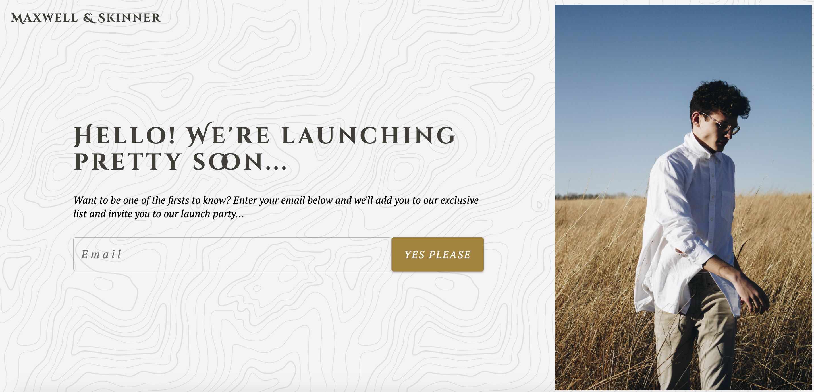

# 👞 Maxwell & Skinner

December 2020

## 🚦 Overview

- My aim was to make a single web design page to **challenge myself with styling.** I wanted to create something sleek and genuine and **mainly to see how my styling has progressed over time.**

## 💻 Technologies & Tools

- React
- Material UI
- SASS
- Whimsical

## 💥 Things I have learnt

- **I am absolutely in love with Material UI.**
- First use of svg.

## 🎯 Comments

- The challenge was to create a professional looking site in an a few hours work. To date, this is one of the easier projects I've completed, but **happy to see that with repetition something like this gets much easier over time.**

## ☄️ Sources

[Andi Rieger](https://unsplash.com/photos/OhHVGV4EUmA)
